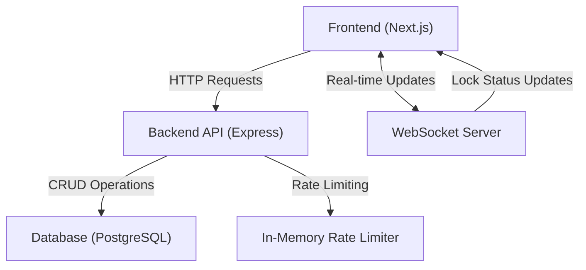

# Architecture Documentation

## Overview
This application implements a real-time collaborative appointment editing system with a locking mechanism. It prevents concurrent edits by allowing only one user to edit an appointment at a time while others can view it. The system also features real-time cursor tracking and admin takeover capabilities.

## System Architecture

### Tech Stack
- **Frontend**: Next.js, TypeScript, Zustand, TailwindCSS
- **Backend**: Node.js, Express, Prisma, PostgreSQL
- **Real-time Communication**: WebSocket
- **Authentication**: JWT

### High-Level Architecture Diagram


## Core Components

### Backend Components

1. **Lock Service**
   - Handles lock acquisition, release, and expiry
   - Implements optimistic locking for concurrent requests
   - Auto-releases locks after 5 minutes of inactivity
   - Broadcasts lock status changes via WebSocket

2. **WebSocket Service**
   - Manages real-time communication
   - Handles cursor position broadcasting
   - Implements message sanitization
   - Maintains connection state

3. **Authentication & Authorization**
   - JWT-based authentication
   - Role-based access control (User/Admin)
   - Token validation middleware

4. **Rate Limiting**
   - In-memory rate limiting for API endpoints
   - Separate limits for lock operations

### Frontend Components

1. **State Management (Zustand)**
   - Centralized lock state
   - Authentication state
   - Real-time cursor positions
   - Clean separation of concerns

2. **Real-time Features**
   - WebSocket connection management
   - Cursor position tracking
   - Lock status synchronization
   - Automatic lock release on tab close

3. **UI Components**
   - Lock status indicators
   - Admin takeover interface
   - Real-time cursor visualization
   - Form state management

## Data Flow

### Lock Acquisition Flow
1. User requests lock through UI
2. Frontend sends POST request to ```/appointments/:id/acquire-lock```
3. If successful:
   - Creates lock in database
   - Broadcasts lock status via WebSocket
   - Returns success response
4. Frontend updates UI and enables editing

### Real-time Cursor Updates
1. User moves cursor in locked appointment
2. Frontend throttles position updates
3. WebSocket sends position to server
4. Server broadcasts to other connected clients
5. Clients render cursor positions with smooth animations

## Security Measures

1. **Authentication**
   - JWT tokens with expiration
   - Secure cookie handling
   - CORS configuration

2. **Authorization**
   - Middleware for role verification
   - Admin-only routes protection
   - Lock ownership validation

3. **Rate Limiting**
   - API endpoint protection
   - Lock attempt limitations
   - WebSocket message throttling

4. **Data Validation**
   - Input sanitization
   - WebSocket message validation
   - Database query protection

## Error Handling

1. **Lock Conflicts**
   - Graceful handling of concurrent requests
   - Clear error messages to users
   - Automatic conflict resolution

2. **Network Issues**
   - WebSocket reconnection logic
   - Failed request retry mechanism
   - State recovery after disconnection

3. **Edge Cases**
   - Browser tab close handling
   - Session expiration handling
   - Database transaction failures

## Performance Considerations

1. **Real-time Updates**
   - Cursor position throttling
   - WebSocket message batching
   - Efficient broadcast implementation

2. **Database**
   - Indexed queries
   - Optimized lock checks
   - Efficient cleanup of expired locks

3. **Frontend**
   - Optimized re-renders
   - Lazy loading components
   - Efficient state updates

## Running the Application

### Prerequisites
- Node.js 18+
- PostgreSQL 14+
- npm or yarn

### Setup Steps
1. Clone the repository
2. Install dependencies:
   ```bash
   # Backend
   cd backend
   npm install

   # Frontend
   cd frontend
   npm install
   ```

3. Configure environment variables:
   ```bash
   # Backend (.env)
   DATABASE_URL=postgresql://...
   JWT_SECRET=your-secret
   FRONTEND_URL=http://localhost:3001

   # Frontend (.env)
   NEXT_PUBLIC_API_URL=http://localhost:3000/api
   ```

4. Run migrations:
   ```bash
   cd backend
   npx prisma migrate dev
   ```

5. Start the applications:
   ```bash
   # Backend
   cd backend
   npm run dev

   # Frontend
   cd frontend
   npm run dev
   ```

## Design Patterns Used

1. **Observer Pattern (WebSocket Events)**
   ```typescript
   class WebSocketService {
     private messageHandlers: Set<MessageHandler> = new Set();

     public subscribe(handler: MessageHandler) {
       this.messageHandlers.add(handler);
       return () => this.messageHandlers.delete(handler);
     }
   }
   ```
   - WebSocket message subscription system
   - Lock status broadcasts
   - Cursor position updates
   - Clean unsubscribe handling

2. **Service Pattern**
   ```typescript
   export class LockService {
     static async acquireLock(appointmentId: string, userId: string): Promise<LockResponse>
     static async releaseLock(appointmentId: string, userId?: string): Promise<LockResponse>
     static async getLockStatus(appointmentId: string): Promise<LockResponse>
   }
   ```
   - Lock service for business logic
   - Audit service for logging
   - WebSocket service for real-time communication

These patterns are actively used in the codebase to maintain code organization, promote reusability, and ensure proper resource management. Each pattern serves a specific purpose in making the application more maintainable and scalable.

## Future Improvements

1. **Scalability**
   - Redis for distributed lock management
   - Horizontal scaling of WebSocket servers
   - Caching layer for frequent queries

2. **Features**
   - Collaborative editing
   - Change history tracking

3. **Monitoring**
   - Performance metrics
   - Error tracking
   - Usage analytics